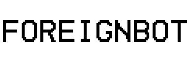

# ForeignBot V2

<p float="left">
    
    
</p>


A multi-purpose Discord bot written in Python using [Disnake](https://github.com/DisnakeDev/disnake) with the aim to be heavily customizable*
>*Not fully implemented yet *(ironic)*, read "[Project Plans](#project-plans)" or "[todo.md](./todo.md)"

*This bot is NOT PG, there's no functional profanity filter yet so cover your children's eyes.*

<br />

**Huge thanks to [CaedenPH](https://github.com/CaedenPH) and contributors for making [JesterBot](https://github.com/CaedenPH/JesterBot), which the structure and most functionality of this bot was heavily inspired by. Please go check out their repository!**

<br />

# Inviting/Hosting ForeignBot

>[!IMPORTANT]
>**Theres no official invite link at the moment!** See [why](#prototyping-phase).

>[!CAUTION]
>**HOSTING YOUR OWN FOREIGNBOT INSTANCE IS NOT ADVISED DURING THE PROTOTYPING PHASE, FEATURES/SECURITY FEATURES WILL BE MISSING AND BUGS WILL BE PRESENT! ONLY DO THIS IF YOU KNOW WHAT YOU'RE DOING! DO NOT USE THIS IN PRODUCTION!**

## Installation
> [!NOTE]
> You're expected to have some sort of knowledge of creating a Discord application through the [Discord Developer Portal](https://discord.com/developers/applications) when going into this.

### Obtaining the Source Code
There are a variety of ways of obtaining the source code, you can either download it from the `Code` button at the top of the repository, clone it from GitHub, or download a release from the [releases page](https://github.com/asuuhdude/ForeignBot/releases).

Ensure you also have the correct Python version needed to run the source code. Any version above 3.7 should work, just make sure all the required libraries are able to run on your version.

### Installing Libraries

> [!NOTE]
> Since this project is still way behind an alpha version, there's no available `requirements.txt` yet.

Here's a list of all the libraries needed to run the source code:
 - disnake
 - colorama
 - aiohttp
 - aiosqlite
 - Faker
 - toml
 - python-dotenv

### Add the Necessary Files

Some files are not included in the source code for security reasons, so you'll need to add them yourself.
<br />

An example of this is the `.env` file, create your own in the root directory of the project (should be in the same folder as the source code).
<br />

The `.env` file should follow:
```
TOKEN=YOUR_APPLICATION_TOKEN
```

### Running the Source Code

After you have installed all the necessary libaries and added the necessary files, you can run the source code by running `python main.py` or `python3 main.py` in the directory.

# Prototyping Phase
This stage of development is rocky! During this stage I'm mainly focused on seeing what sticks and what doesn't. **That means there will be no official public instance of ForeignBot yet.**
<br />

Optimization and efficiency is my second priority during this time, if you find bugs or propose a better method to my madness, please open an [issue](#reporting-an-issuevulnerability).

Keep in mind the source code during this time will look chaotic, as updates go along and new features are added the source code will be more and more presentable.

# Project Plans
Here's a list of what I have planned for future features, explained in more detail compared to the [todo.md](./todo.md) file.
<br />

If anything ends with a question mark then it isn't fully decided whether it will be added or not. No guarantees!
<br />
Order is not important, but anything **bolded** is considered a higher priority. However [todo.md](./todo.md) follows a structural heirarchy.


- Moderation
  - 
  - Create the moderation cog and basic moderation commands.
- Economy
  - 
  - Better shop handling and inventory management.
  - Simulated stock market where users can invest in fake stocks for ForeignCoins?
    - *Maybe add the ability for users to create their own stocks that other users can invest in with a certain amount of ForeignCoins?*
- Miscellaneous
  - 
  - More robust achievement handling, current system is held together by hopes and dreams.
    - ~~*Remove the achievement system?*~~ Nah. Make it an option.
  - **Add the entire gimmick of this Discord bot, customization.**
  - The ability to actually use items, only item with any current ability is the Scary Mask.
  - **Add an actual help command.**
  - ~~**Upgrade to Python version 3.11 (perferrably before we reach an Alpha phase), since 3.9 will be reaching EoS in 2025.**~~
    - *Anything higher than 3.9 should be fine, but 3.11 has a lot of perferrable features.*
  - Create Docker instance.

# Reporting an Issue/Vulnerability

> [!NOTE]
> For contributing see "[Contributing](#contributing)"

If you've found a bug, or something that is comprising the integrity of security of the project, please open an [issue](https://github.com/asuuhdude/ForeignBot/issues). I will try to resolve your issue as soon as possible.
<br />

I'm not too heavy on using labels on issues, but if you know what you're doing and want to help the issue-resolving-process be more efficient, then please attach an appropriate label.
<br />

**BUT PLEASE make your issue coherent and relevant, if it doesn't fall within those two categories it will be marked as https://github.com/asuuhdude/ForeignBot/labels/invalid or https://github.com/asuuhdude/ForeignBot/labels/wontfix.**

# Contributing

If you'd like to contribute to the project, you're welcome to do so! Before you do submit a pull request, please make an issue about the feature you'd like to add. There's no garuantee that your pull request will be accepted, but I still love seeing your interest and work!